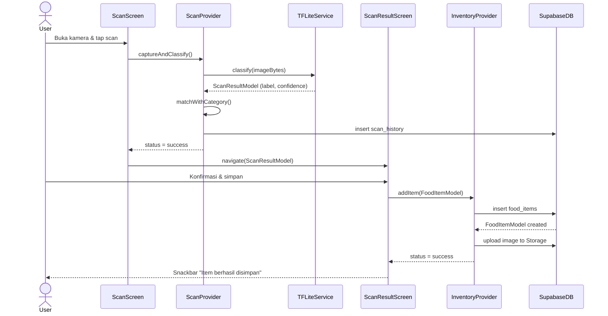
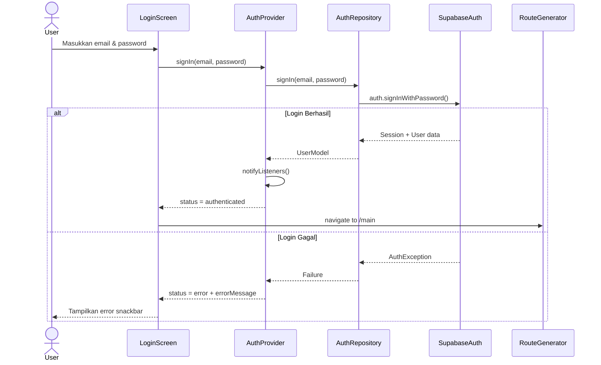
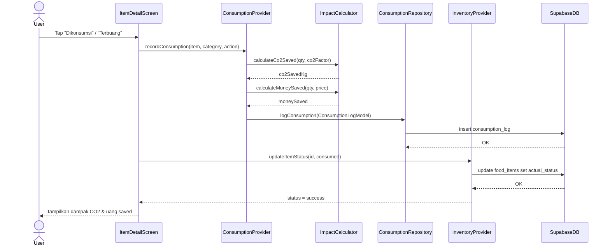
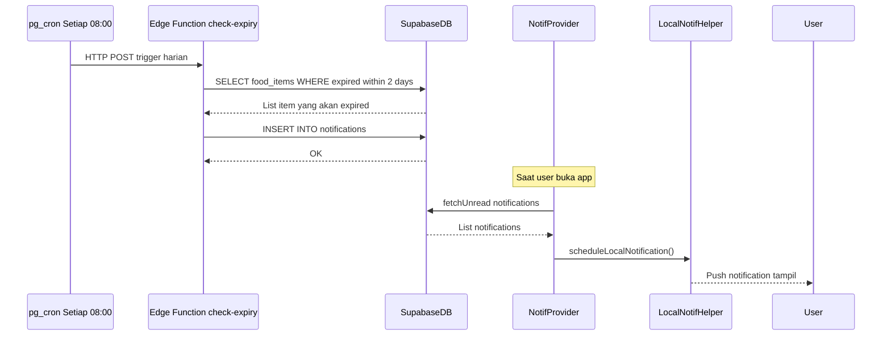
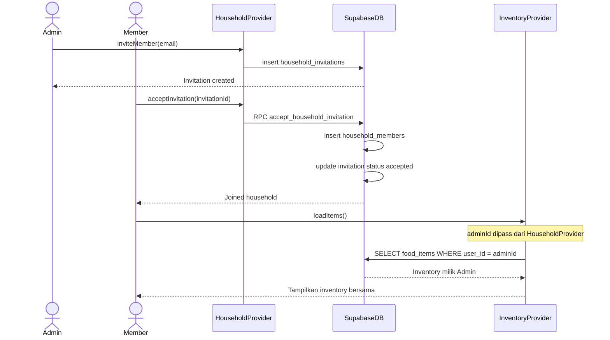
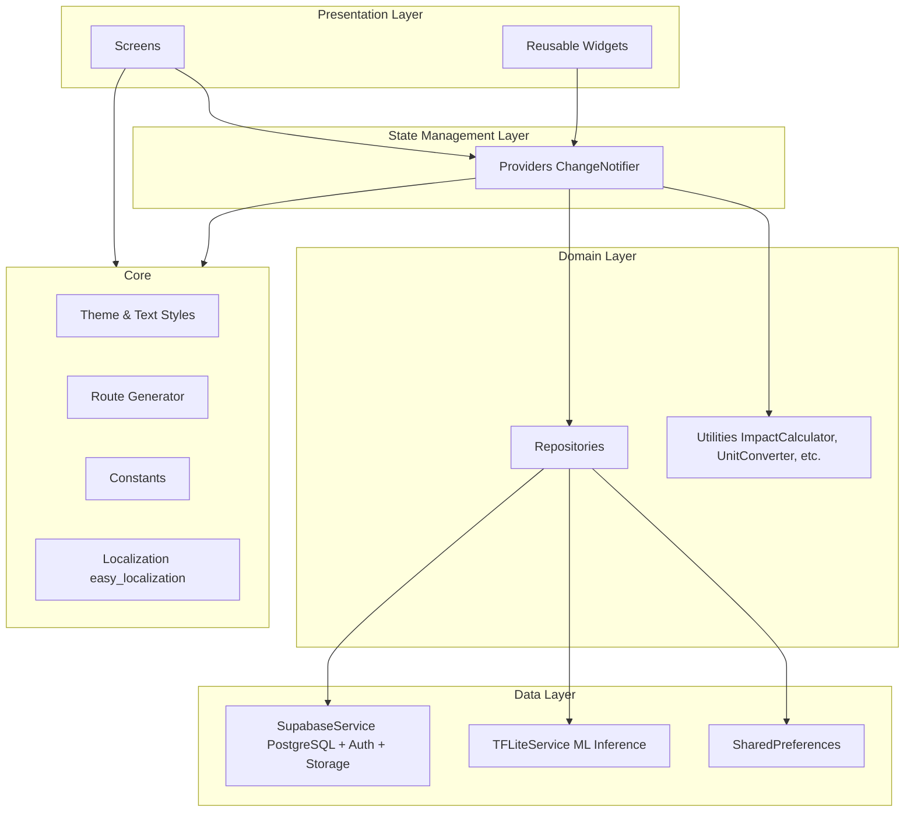
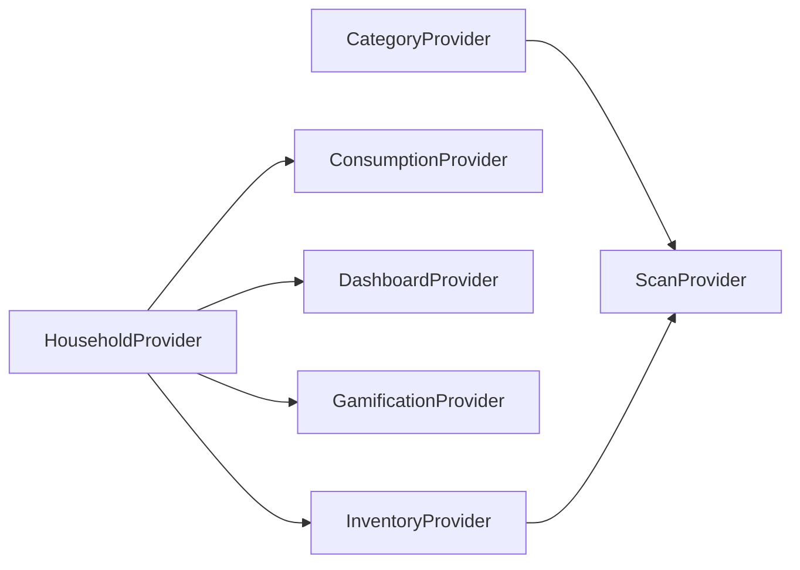

# HomeCycle

> **Aplikasi Flutter untuk mengurangi food waste melalui scan buah/sayur berbasis AI, manajemen inventory, dan gamifikasi.**

[](https://flutter.dev)
[](https://dart.dev)
[](https://supabase.io)
[](https://www.tensorflow.org/lite)

---

## Daftar Isi

1. [Tentang Aplikasi](#-tentang-aplikasi)
2. [Fitur Utama](#-fitur-utama)
3. [Tech Stack](#-tech-stack)
4. [Diagram Use Case](#-diagram-use-case)
5. [Entity Relationship Diagram (ERD)](#-entity-relationship-diagram-erd)
6. [Sequence Diagrams](#-sequence-diagrams)
7. [Arsitektur Aplikasi](#-arsitektur-aplikasi)
8. [Struktur Folder](#-struktur-folder)
9. [Dokumentasi Codebase](#-dokumentasi-codebase)
10. [Setup & Instalasi](#-setup--instalasi)
11. [Konfigurasi Database](#-konfigurasi-database)
12. [Environment Variables](#-environment-variables)
13. [Kontribusi](#-kontribusi)

---

## Tentang Aplikasi

**HomeCycle** adalah aplikasi mobile berbasis Flutter yang membantu pengguna mengurangi food waste di rumah tangga. Aplikasi menggunakan model machine learning (TFLite) untuk mendeteksi jenis dan kondisi buah/sayur melalui kamera, lalu mengelola inventory dengan estimasi tanggal kadaluarsa otomatis.

### Masalah yang Diselesaikan

- **Food waste** yang tidak tertrack di rumah tangga
- **Lupa tanggal kadaluarsa** bahan makanan
- **Tidak ada insight** tentang dampak lingkungan dari pemborosan makanan
- **Tidak ada kolaborasi** dalam manajemen stok keluarga

---

## Fitur Utama

| Fitur | Deskripsi |
|---|---|
| **AI Scan** | Scan buah/sayur via kamera, deteksi jenis & kondisi dengan TFLite |
| **Inventory Management** | Kelola stok dengan estimasi expired date otomatis |
| **Smart Notifications** | Reminder H-2 sebelum kadaluarsa via local & push notification |
| **Dashboard** | Statistik real-time stok aktif, expired, dan yang akan kadaluarsa |
| **Impact Tracker** | Kalkulasi CO₂ & uang yang berhasil diselamatkan |
| **Gamifikasi** | Achievement & badge untuk mendorong kebiasaan zero-waste |
| **Household** | Berbagi inventory dengan anggota keluarga/rumah tangga |
| **Recipe Rescue** | Saran resep berdasarkan bahan yang hampir kadaluarsa |
| **Multilingual** | Dukungan Bahasa Indonesia & English |

---

## Tech Stack

| Layer | Teknologi |
|---|---|
| **Framework** | Flutter 3.x (Dart 3.12+) |
| **State Management** | Provider (ChangeNotifier pattern) |
| **Backend & Database** | Supabase (PostgreSQL) |
| **Authentication** | Supabase Auth |
| **Storage** | Supabase Storage (foto hasil scan) |
| **AI/ML** | TensorFlow Lite (TFLite) |
| **Notifications** | flutter_local_notifications + Supabase Edge Functions |
| **Localization** | easy_localization |
| **Fonts** | Google Fonts |
| **Date/Time** | intl + timeago |

---

## Diagram Use Case

```mermaid
graph TD
    subgraph Actors
        GuestUser["Guest User"]
        AuthUser["Authenticated User"]
        HouseAdmin["Household Admin"]
        System["System"]
    end

    subgraph UC_Auth["Authentication"]
        UC1["UC-01: Register"]
        UC2["UC-02: Login"]
        UC3["UC-03: Forgot Password"]
    end

    subgraph UC_Scan["Scan & Detection"]
        UC4["UC-04: Scan Buah/Sayur"]
        UC5["UC-05: Lihat Hasil Deteksi"]
        UC6["UC-06: Simpan ke Inventory"]
        UC7["UC-07: Edit Hasil Scan"]
    end

    subgraph UC_Inventory["Inventory Management"]
        UC8["UC-08: Lihat Daftar Inventory"]
        UC9["UC-09: Filter & Cari Item"]
        UC10["UC-10: Lihat Detail Item"]
        UC11["UC-11: Edit Item"]
        UC12["UC-12: Tandai Consumed/Wasted"]
        UC13["UC-13: Hapus Item"]
    end

    subgraph UC_Dashboard["Dashboard & Stats"]
        UC14["UC-14: Lihat Dashboard"]
        UC15["UC-15: Lihat Impact Stats"]
        UC16["UC-16: Lihat Riwayat Konsumsi"]
    end

    subgraph UC_Gamification["Gamifikasi"]
        UC17["UC-17: Lihat Achievement"]
        UC18["UC-18: Klaim Badge"]
    end

    subgraph UC_Notif["Notifikasi"]
        UC19["UC-19: Lihat Notifikasi"]
        UC20["UC-20: Kirim Reminder Expired"]
        UC21["UC-21: Atur Preferensi Notif"]
    end

    subgraph UC_Household["Household"]
        UC22["UC-22: Buat Household"]
        UC23["UC-23: Undang Anggota"]
        UC24["UC-24: Kelola Anggota"]
        UC25["UC-25: Lihat Inventory Bersama"]
    end

    subgraph UC_Profile["Profil & Pengaturan"]
        UC26["UC-26: Edit Profil"]
        UC27["UC-27: Ganti Bahasa"]
        UC28["UC-28: Atur Preferensi"]
    end

    GuestUser --> UC1
    GuestUser --> UC2
    GuestUser --> UC3

    AuthUser --> UC4
    UC4 --> UC5
    UC5 --> UC6
    UC5 --> UC7

    AuthUser --> UC8
    UC8 --> UC9
    UC8 --> UC10
    UC10 --> UC11
    UC10 --> UC12
    UC10 --> UC13

    AuthUser --> UC14
    UC14 --> UC15
    UC14 --> UC16

    AuthUser --> UC17
    System --> UC18

    AuthUser --> UC19
    System --> UC20
    AuthUser --> UC21

    HouseAdmin --> UC22
    HouseAdmin --> UC23
    HouseAdmin --> UC24
    AuthUser --> UC25

    AuthUser --> UC26
    AuthUser --> UC27
    AuthUser --> UC28
```



---

## Entity Relationship Diagram (ERD)

```mermaid
erDiagram
    auth_users {
        uuid id PK
        text email
        text encrypted_password
        timestamptz created_at
    }

    categories {
        uuid id PK
        text name
        text type
        int default_shelf_life_days
        int fridge_shelf_life_days
        text storage_tip
        text icon_url
        numeric co2_factor_kg
        numeric avg_price_per_unit
        numeric avg_weight_per_unit_gram
        timestamptz created_at
    }

    food_items {
        uuid id PK
        uuid user_id FK
        uuid category_id FK
        text custom_name
        text condition
        float confidence_score
        numeric quantity
        text unit
        text storage_location
        timestamptz scanned_at
        date estimated_expired_date
        text actual_status
        text image_url
        timestamptz created_at
        timestamptz updated_at
    }

    scan_history {
        uuid id PK
        uuid user_id FK
        uuid food_item_id FK
        uuid category_id FK
        text detected_label
        float confidence_score
        text image_url
        boolean was_saved_to_inventory
        timestamptz scanned_at
    }

    consumption_log {
        uuid id PK
        uuid user_id FK
        uuid food_item_id FK
        uuid category_id FK
        text action
        numeric quantity
        numeric co2_saved_kg
        numeric money_saved
        text reason
        timestamptz logged_at
    }

    notifications {
        uuid id PK
        uuid user_id FK
        uuid food_item_id FK
        text type
        text title
        text body
        boolean is_read
        timestamptz scheduled_at
        timestamptz sent_at
        timestamptz created_at
    }

    user_preferences {
        uuid user_id PK_FK
        int notify_days_before_expiry
        int household_size
        text preferred_units
        text preferred_language
        timestamptz updated_at
    }

    achievements {
        uuid id PK
        text code
        text title
        text description
        text icon_url
        text criteria_type
        numeric criteria_value
        timestamptz created_at
    }

    user_achievements {
        uuid id PK
        uuid user_id FK
        uuid achievement_id FK
        timestamptz achieved_at
    }

    household_members {
        uuid id PK
        uuid admin_id FK
        uuid member_id FK
        text role
        timestamptz joined_at
    }

    household_invitations {
        uuid id PK
        uuid admin_id FK
        uuid invitee_id FK
        text status
        timestamptz created_at
        timestamptz expires_at
    }

    auth_users ||--o{ food_items : "memiliki"
    auth_users ||--o{ scan_history : "melakukan"
    auth_users ||--o{ consumption_log : "mencatat"
    auth_users ||--o{ notifications : "menerima"
    auth_users ||--|| user_preferences : "memiliki"
    auth_users ||--o{ user_achievements : "mendapat"
    auth_users ||--o{ household_members : "bergabung"
    auth_users ||--o{ household_invitations : "mengundang"

    categories ||--o{ food_items : "diklasifikasikan"
    categories ||--o{ scan_history : "terdeteksi sebagai"
    categories ||--o{ consumption_log : "dicatat dalam"

    food_items ||--o{ scan_history : "menghasilkan"
    food_items ||--o{ consumption_log : "dicatat dalam"
    food_items ||--o{ notifications : "memicu"

    achievements ||--o{ user_achievements : "diraih oleh"
```

---

## Sequence Diagrams

### 1. Alur Scan & Simpan ke Inventory



### 2. Alur Login & Autentikasi



### 3. Alur Catat Konsumsi (Consumed/Wasted)



### 4. Alur Notifikasi Expired (Automated)



### 5. Alur Household & Shared Inventory



---

## Arsitektur Aplikasi

HomeCycle menggunakan **Feature-First Architecture** dengan pola **Repository-Provider**:



### Pola Dependency Injection (Provider)



> **Catatan**: `HouseholdProvider` menyediakan `adminId` ke provider lain melalui `ChangeNotifierProxyProvider` sehingga anggota household dapat melihat inventory milik admin.

---

## Struktur Folder

```
homesikil/
├── pubspec.yaml                        # Dependencies & assets config
├── analysis_options.yaml               # Dart linting rules
├── run.ps1                             # Script run di Windows
│
├── assets/
│   ├── models/                         # File model TFLite (.tflite)
│   ├── labels/                         # Label output model ML
│   ├── translations/                   # File JSON lokalisasi (id.json, en.json)
│   └── images/
│       ├── icons/                      # Icon buah/sayur
│       ├── mascots/                    # Ilustrasi maskot
│       ├── food-images/                # Gambar referensi makanan
│       └── badges/                     # Badge achievement
│
├── supabase/
│   ├── migrations/                     # SQL migration files (001-020)
│   ├── functions/
│   │   └── check-expiry/               # Edge Function: cek expired harian
│   └── seed/                           # Data seed kategori
│
├── lib/
│   ├── main.dart                       # Entry point, setup Provider & app
│   ├── splash_screen.dart              # Splash screen & auth redirect
│   │
│   ├── core/
│   │   ├── constants/                  # Konstanta aplikasi
│   │   ├── localization/               # Setup lokalisasi
│   │   ├── network/                    # Network utilities
│   │   ├── theme/
│   │   │   ├── app_theme.dart          # ThemeData konfigurasi
│   │   │   └── app_text_styles.dart    # TextStyle presets
│   │   └── utils/
│   │       ├── action_throttler.dart   # Rate limiter untuk aksi user
│   │       ├── app_snackbar.dart       # Global snackbar helper
│   │       ├── date_helper.dart        # Format & kalkulasi tanggal
│   │       ├── image_helper.dart       # Kompresi & crop gambar
│   │       ├── impact_calculator.dart  # Kalkulasi CO2 & money saved
│   │       ├── local_notification_helper.dart
│   │       ├── unit_converter.dart     # Konversi satuan (pcs ke kg)
│   │       └── validators.dart         # Form validators
│   │
│   ├── data/
│   │   ├── remote/
│   │   │   ├── supabase_service.dart   # Singleton Supabase client
│   │   │   └── tflite_service.dart     # TFLite model loader & inference
│   │   └── local/                      # Local storage (SharedPreferences)
│   │
│   ├── errors/
│   │   └── failure.dart                # Custom Failure class
│   │
│   ├── routes/
│   │   ├── app_routes.dart             # Route name constants
│   │   ├── route_generator.dart        # Route builder & guard
│   │   └── main_wrapper.dart           # Bottom nav wrapper
│   │
│   ├── widgets/                        # Global shared widgets
│   │
│   └── features/
│       ├── auth/                       # Autentikasi
│       │   ├── models/
│       │   │   └── user_model.dart
│       │   ├── repository/
│       │   │   └── auth_repository.dart
│       │   ├── provider/
│       │   │   └── auth_provider.dart
│       │   ├── screens/
│       │   │   ├── login_screen.dart
│       │   │   ├── register_screen.dart
│       │   │   └── forgot_password_screen.dart
│       │   └── widgets/
│       │
│       ├── onboarding/                 # Onboarding flow
│       │   ├── models/
│       │   ├── provider/
│       │   └── screens/
│       │
│       ├── category/                   # Master data kategori
│       │   ├── models/
│       │   │   └── category_model.dart
│       │   ├── repository/
│       │   │   └── category_repository.dart
│       │   └── provider/
│       │       └── category_provider.dart
│       │
│       ├── scan/                       # Fitur scan AI
│       │   ├── models/
│       │   │   └── scan_result_model.dart
│       │   ├── repository/
│       │   │   └── scan_repository.dart
│       │   ├── provider/
│       │   │   └── scan_provider.dart
│       │   ├── screens/
│       │   │   ├── scan_screen.dart
│       │   │   └── scan_result_screen.dart
│       │   └── widgets/
│       │
│       ├── inventory/                  # Manajemen inventory
│       │   ├── models/
│       │   │   └── food_item_model.dart
│       │   ├── repository/
│       │   │   └── inventory_repository.dart
│       │   ├── provider/
│       │   │   └── inventory_provider.dart
│       │   ├── screens/
│       │   │   ├── inventory_screen.dart
│       │   │   ├── item_detail_screen.dart
│       │   │   └── add_edit_item_screen.dart
│       │   └── widgets/
│       │
│       ├── consumption/                # Log konsumsi & food waste
│       │   ├── models/
│       │   │   └── consumption_log_model.dart
│       │   ├── repository/
│       │   │   └── consumption_repository.dart
│       │   └── provider/
│       │       └── consumption_provider.dart
│       │
│       ├── dashboard/                  # Dashboard & statistik
│       │   ├── models/
│       │   ├── repository/
│       │   │   └── dashboard_repository.dart
│       │   ├── provider/
│       │   │   └── dashboard_provider.dart
│       │   ├── screens/
│       │   └── widgets/
│       │       └── quick_stats_card.dart
│       │
│       ├── gamification/               # Achievement & badge
│       │   ├── models/
│       │   │   ├── achievement_model.dart
│       │   │   └── impact_stats_model.dart
│       │   ├── repository/
│       │   │   └── gamification_repository.dart
│       │   ├── provider/
│       │   │   └── gamification_provider.dart
│       │   ├── screens/
│       │   │   └── impact_dashboard_screen.dart
│       │   └── widgets/
│       │
│       ├── notification/               # Notifikasi
│       │   ├── models/
│       │   ├── repository/
│       │   │   └── notification_repository.dart
│       │   ├── provider/
│       │   │   └── notification_provider.dart
│       │   ├── screens/
│       │   │   └── notification_screen.dart
│       │   └── widgets/
│       │
│       ├── household/                  # Manajemen household
│       │   ├── models/
│       │   │   ├── household_member_model.dart
│       │   │   └── household_invitation_model.dart
│       │   ├── repository/
│       │   │   └── household_repository.dart
│       │   └── provider/
│       │       └── household_provider.dart
│       │
│       ├── profile/                    # Profil & pengaturan user
│       │   ├── models/
│       │   ├── repository/
│       │   └── provider/
│       │       └── profile_provider.dart
│       │
│       └── recipe_rescue.dart/         # Saran resep anti-waste
│           ├── models/
│           ├── provider/
│           ├── repository/
│           ├── screens/
│           └── widgets/
│
└── test/
    └── widget_test.dart
```

---

## Dokumentasi Codebase

### `lib/main.dart` — Entry Point

File ini adalah titik masuk aplikasi. Menginisialisasi:
- **EasyLocalization** untuk i18n
- **SupabaseService** (koneksi ke Supabase)
- **MultiProvider** untuk dependency injection semua Provider

**Pola dependency injection Provider:**
```dart
// Provider biasa (independent)
ChangeNotifierProvider(create: (_) => AuthProvider(AuthRepository()))

// Provider yang bergantung pada HouseholdProvider (untuk shared inventory)
ChangeNotifierProxyProvider<HouseholdProvider, InventoryProvider>(
  update: (_, household, inventory) => inventory!..updateAdminId(household.adminId),
)

// Provider dengan 2 dependency
ChangeNotifierProxyProvider2<CategoryProvider, InventoryProvider, ScanProvider>(...)
```

---

### `lib/data/remote/supabase_service.dart` — Supabase Client

Singleton wrapper untuk koneksi Supabase.

```dart
SupabaseService.initialize()    // dipanggil di main()
SupabaseService.client          // SupabaseClient instance
SupabaseService.currentUserId   // String? user ID yang sedang login
```

---

### `lib/data/remote/tflite_service.dart` — AI Inference

Mengelola siklus hidup model TFLite:
- **Load model** dari `assets/models/`
- **Load labels** dari `assets/labels/`
- **Inference**: preprocessing gambar → run model → postprocessing hasil

```dart
final results = await TFLiteService().classify(imageBytes);
// returns: List<Map<String, dynamic>> berisi label & confidence
```

---

### Feature: `auth`

| File | Deskripsi |
|---|---|
| `user_model.dart` | Model data user (id, email) |
| `auth_repository.dart` | `signIn()`, `signUp()`, `signOut()`, `resetPassword()` via Supabase Auth |
| `auth_provider.dart` | State management autentikasi, listen auth state changes |
| `login_screen.dart` | Form login dengan validasi |
| `register_screen.dart` | Form registrasi dengan validasi |
| `forgot_password_screen.dart` | Form reset password via email |

---

### Feature: `category`

| File | Deskripsi |
|---|---|
| `category_model.dart` | Model master data buah/sayur (nama, jenis, shelf life, CO₂ factor, harga) |
| `category_repository.dart` | `getAllCategories()`, `getByType()`, `getById()` dari tabel `categories` |
| `category_provider.dart` | Cache kategori di memory, diakses oleh `ScanProvider` |

**`CategoryModel` fields:**
```dart
class CategoryModel {
  final String id;
  final String name;
  final String type;                  // 'fruit' | 'vegetable'
  final int defaultShelfLifeDays;
  final int? fridgeShelfLifeDays;
  final double? co2FactorKg;          // kg CO2e per kg makanan
  final double? avgPricePerUnit;      // harga rata-rata per satuan
  final double? avgWeightPerUnitGram; // konversi pcs ke kg
}
```

---

### Feature: `scan`

| File | Deskripsi |
|---|---|
| `scan_result_model.dart` | Model hasil scan (label, confidence, matched category) |
| `scan_repository.dart` | Simpan log scan ke tabel `scan_history` |
| `scan_provider.dart` | Orkestrasi scan: kamera → TFLite → match category → simpan |
| `scan_screen.dart` | UI kamera real-time |
| `scan_result_screen.dart` | Tampilkan hasil deteksi, form konfirmasi sebelum simpan ke inventory |

**Alur di `ScanProvider`:**
1. `captureAndClassify()` → ambil gambar dari kamera
2. `TFLiteService.classify()` → dapatkan label & confidence
3. Match label dengan `CategoryProvider.categories`
4. Simpan log ke `scan_history` via `ScanRepository`
5. Navigate ke `ScanResultScreen`

---

### Feature: `inventory`

| File | Deskripsi |
|---|---|
| `food_item_model.dart` | Model item inventory |
| `inventory_repository.dart` | CRUD operasi pada tabel `food_items` |
| `inventory_provider.dart` | State management list inventory, filter, & CRUD actions |
| `inventory_screen.dart` | Daftar inventory dengan filter status & kategori |
| `item_detail_screen.dart` | Detail item, aksi consumed/wasted, hapus |
| `add_edit_item_screen.dart` | Form tambah/edit item manual |

**`FoodItemModel` computed properties:**
```dart
int get daysUntilExpiration =>
    estimatedExpiredDate.difference(DateTime.now()).inDays;

bool get isExpiringSoon => daysUntilExpiration <= 2 && daysUntilExpiration >= 0;
bool get isExpired => daysUntilExpiration < 0;
bool get isActive => actualStatus == 'active';
```

**Status lifecycle item:**
```
active → consumed  (dikonsumsi oleh user)
active → wasted    (terbuang / tidak sempat dikonsumsi)
active → expired   (otomatis via cron job harian)
```

---

### Feature: `consumption`

| File | Deskripsi |
|---|---|
| `consumption_log_model.dart` | Model log konsumsi (action, qty, co2_saved, money_saved) |
| `consumption_repository.dart` | Insert ke tabel `consumption_log` |
| `consumption_provider.dart` | `recordConsumption()` — kalkulasi impact lalu simpan |

**Alur kalkulasi impact di `ConsumptionProvider`:**
```dart
// Konversi satuan ke kg
final quantityKg = UnitConverter.toKg(quantity, unit, avgWeightPerUnitGram);

// Kalkulasi CO2 & uang yang diselamatkan
final co2Saved = ImpactCalculator.calculateCo2Saved(quantityKg, co2FactorPerKg);
final moneySaved = ImpactCalculator.calculateMoneySaved(quantity, avgPricePerUnit);
```

---

### Feature: `dashboard`

| File | Deskripsi |
|---|---|
| `dashboard_repository.dart` | Query statistik via view Supabase (`monthly_waste_stats`, `user_impact_stats`) |
| `dashboard_provider.dart` | Aggregasi data untuk tampilan dashboard |
| `quick_stats_card.dart` | Widget kartu statistik cepat (aktif, expired, dikonsumsi) |

---

### Feature: `gamification`

| File | Deskripsi |
|---|---|
| `achievement_model.dart` | Model achievement (code, title, criteria_type, criteria_value) |
| `impact_stats_model.dart` | Model stats dampak total (CO₂ saved, money saved, items saved/wasted) |
| `gamification_repository.dart` | Query achievements & user_achievements dari Supabase |
| `gamification_provider.dart` | State management achievement & impact stats |
| `impact_dashboard_screen.dart` | Dashboard dampak lingkungan & daftar achievement |

---

### Feature: `notification`

| File | Deskripsi |
|---|---|
| `notification_repository.dart` | Fetch notifikasi dari tabel `notifications`, mark as read |
| `notification_provider.dart` | State management list notifikasi & unread count |
| `notification_screen.dart` | Daftar notifikasi dengan mark-as-read |

---

### Feature: `household`

| File | Deskripsi |
|---|---|
| `household_member_model.dart` | Model anggota household (admin_id, member_id, role, joined_at) |
| `household_invitation_model.dart` | Model undangan household |
| `household_repository.dart` | CRUD member, send/accept/reject invitation via RPC |
| `household_provider.dart` | State management household, expose `adminId` ke provider lain |

**Konsep Shared Inventory:**
> Ketika user bergabung sebagai member household, `adminId` dari `HouseholdProvider` di-pass ke `InventoryProvider`, `ConsumptionProvider`, dan `DashboardProvider` sehingga semua data ditampilkan dari sudut pandang admin household.

---

### `lib/core/utils/` — Utilities

| File | Deskripsi |
|---|---|
| `impact_calculator.dart` | `calculateCo2Saved(qty, factor)`, `calculateMoneySaved(qty, price)` |
| `unit_converter.dart` | `toKg(quantity, unit, avgWeightPerUnitGram)` — konversi pcs/gram/ikat → kg |
| `date_helper.dart` | Format tanggal relatif & absolut |
| `image_helper.dart` | Resize & compress gambar sebelum upload |
| `app_snackbar.dart` | Global snackbar dengan `GlobalKey<ScaffoldMessengerState>` |
| `local_notification_helper.dart` | Setup & schedule local notifications |
| `action_throttler.dart` | Debounce & throttle untuk mencegah double-submit |
| `validators.dart` | Validasi form (email, password, quantity) |

---

### `lib/routes/` — Navigation

| File | Deskripsi |
|---|---|
| `app_routes.dart` | Konstanta nama route (string) |
| `route_generator.dart` | `generateRoute()` — builder semua halaman + route guard (auth check) |
| `main_wrapper.dart` | Bottom navigation bar wrapper (Dashboard, Inventory, Scan, Notifikasi, Profil) |

**Daftar Route:**

| Route | Screen |
|---|---|
| `/` | SplashScreen |
| `/login` | LoginScreen |
| `/register` | RegisterScreen |
| `/onboarding` | OnboardingScreen |
| `/main` | MainWrapper (Bottom Nav) |
| `/inventory` | InventoryScreen |
| `/inventory/detail` | ItemDetailScreen |
| `/inventory/add-edit` | AddEditItemScreen |
| `/scan` | ScanScreen |
| `/scan/result` | ScanResultScreen |
| `/notification` | NotificationScreen |
| `/impact` | ImpactDashboardScreen |
| `/profile` | ProfileScreen |
| `/settings` | SettingsScreen |
| `/settings/language` | LanguageSettingsScreen |
| `/settings/notifications` | NotificationSettingsScreen |
| `/settings/household` | HouseholdMembersScreen |
| `/settings/help` | HelpSupportScreen |
| `/settings/about` | AboutScreen |
| `/profile/edit` | EditProfileScreen |

---

## Setup & Instalasi

### Prasyarat

- Flutter SDK `^3.12.2`
- Dart `^3.12.2`
- Akun [Supabase](https://supabase.io)
- Supabase CLI (`npm install -g supabase`)

### Langkah Instalasi

```bash
# 1. Clone repository
git clone <repository-url>
cd homesikil

# 2. Install dependencies
flutter pub get

# 3. Konfigurasi environment variable (lihat bagian Environment Variables)

# 4. Setup database (lihat bagian Konfigurasi Database)

# 5. Jalankan aplikasi
flutter run
# atau untuk Windows:
.\run.ps1
```

---

## Konfigurasi Database

### Urutan Migrasi

```bash
# Link ke project Supabase
supabase link --project-ref <PROJECT_REF>

# Jalankan semua migrasi
supabase migration up
```

| # | File | Deskripsi |
|---|---|---|
| 001 | `create_categories.sql` | Master data buah/sayur |
| 002 | `create_food_items.sql` | Tabel inventory utama |
| 003 | `create_scan_history.sql` | Log aktivitas scan |
| 004 | `create_consumption_log.sql` | Log konsumsi & food waste |
| 005 | `create_notifications.sql` | Tabel notifikasi |
| 006 | `create_user_preferences.sql` | Preferensi user |
| 007 | `create_achievements.sql` | Data achievement & gamifikasi |
| 008 | `create_rls_policies.sql` | Row Level Security semua tabel |
| 009 | `create_views.sql` | View dashboard & statistik |
| 010 | `create_functions_triggers.sql` | Trigger `updated_at` & `handle_new_user` |
| 011 | `create_household_members.sql` | Tabel household members |
| 012 | `household_invitations.sql` | Sistem undangan household |
| 013-019 | `fix_*`, `alter_*` | Perbaikan & penyempurnaan |
| 020 | `remove_deprecated_categories.sql` | Hapus kategori yang tidak didukung model |

### Seed Data

```bash
supabase db execute -f supabase/seed/categories_seed.sql
```

>  **Penting**: Seed data `categories` harus sinkron dengan label output model TFLite. Jangan seed kategori yang tidak bisa dideteksi model.

### Storage Bucket

Buat bucket untuk foto scan via SQL Editor:
```sql
INSERT INTO storage.buckets (id, name, public)
VALUES ('scan-photos', 'scan-photos', false);
```

### Edge Function (Cron Expired Check)

```bash
supabase functions deploy check-expiry
```

Setup cron job di SQL Editor:
```sql
SELECT cron.schedule(
  'check-expiring-items',
  '0 8 * * *',
  $$ SELECT net.http_post(url := 'https://<PROJECT_REF>.supabase.co/functions/v1/check-expiry', ...) $$
);
```

---

## Environment Variables

Set melalui `--dart-define` saat menjalankan atau di konfigurasi run/build:

```
SUPABASE_URL=https://<PROJECT_REF>.supabase.co
SUPABASE_ANON_KEY=<ANON_KEY>
```

>  **JANGAN pernah commit `SUPABASE_SERVICE_ROLE_KEY`** ke repository. Key ini hanya digunakan di Edge Function server-side.

---

## Kontribusi

### Aturan Perubahan Schema Database

- **Selalu buat file migration baru**, jangan edit file yang sudah di-apply ke production
- Format nama file: `NNN_deskripsi_singkat.sql` (nomor urut 3 digit)
- Setiap migration tabel personal **wajib** langsung menyertakan RLS policy
- Sebelum mengubah kolom, cek semua `fromJson`/`toJson` di `lib/features/*/models/`

### Checklist Sebelum PR

- [ ] Migration dijalankan tanpa error
- [ ] RLS aktif di semua tabel personal
- [ ] Seed data tersinkron dengan label model TFLite
- [ ] Widget test tidak rusak (`flutter test`)
- [ ] Tidak ada debug print yang tertinggal

---

<div align="center">

**HomeCycle** — _Kurangi food waste, mulai dari dapur rumahmu_ 

</div>
